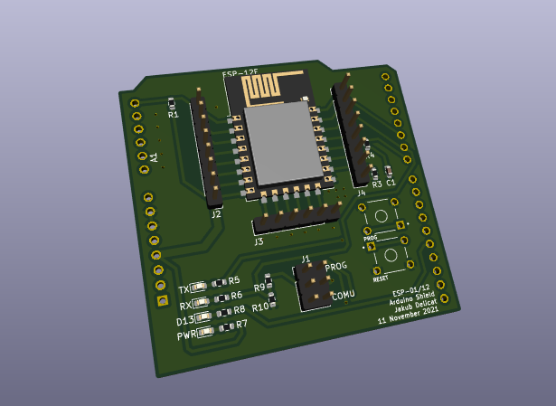
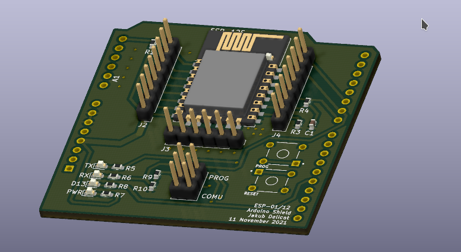

# esp-shield
Shield for Arduino Uno to upload and communicate with ESP-01 and ESP-12E.
# Features
- programmable ESP
- soft serial for arduino
- jumper between RX TX frmm Arduino and ESP for programming mode and communication
- extruded ESP-12E pinout

# 3D model photos

